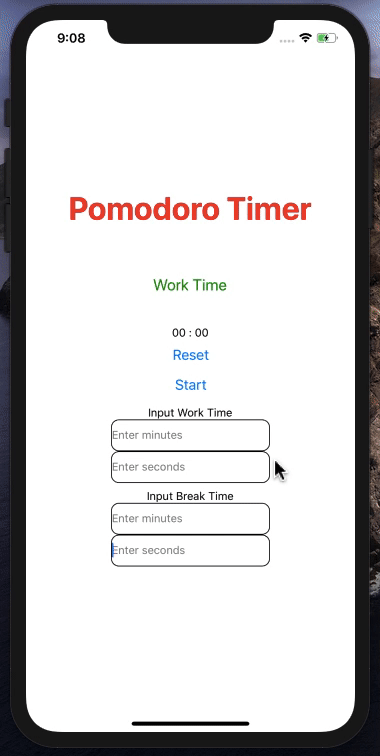

# Pomodoro Timer

This project is implementing a Pomodoro timer. This timer will help
people trying to use the [Pomodoro Technique](https://en.wikipedia.org/wiki/Pomodoro_Technique).
It will vibrate to tell you when to take breaks or resume working, based on some
determined values. 

The default timer starts with 25 minutes of work time and 5 minutes of break. It also allows users to set the time manually according to their liking. 

** This project was done in React-Native**

